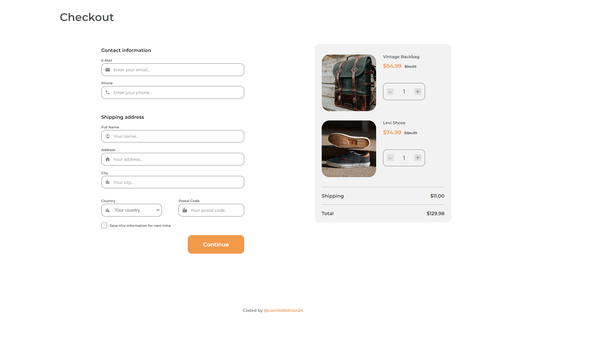

<!-- Please update value in the {}  -->

<h1 align="center">Checkout Landing Page</h1>

   Solution for a challenge from  <a href="http://devchallenges.io" target="_blank">Devchallenges.io</a>.

  <h3>
    <a href="https://camilobeltran24.github.io/checkout-page-devchallenge/">
      Demo
    </a>
     | 
    <a href="https://{your-url-to-the-solution}">
      Solution
    </a>
     | 
    <a href="https://devchallenges.io/challenges/0J1NxxGhOUYVqihwegfO">
      Challenge
    </a>
  </h3>

<!-- TABLE OF CONTENTS -->

## Table of Contents

- [Overview](#overview)
  - [Built With](#built-with)
- [Contact](#contact)

<!-- OVERVIEW -->

## Overview

For this challenge I have created a new landing page, according to the given design, this landing page fulfills the basic functionalities requested by the challenge

### Built With
- HTML
- CSS
- JavaScript

## Contact

- linkedIn [@camilobeltran24](https://www.linkedin.com/in/camilobeltran24/)
- GitHub [@CamiloBeltran24](https://github.com/CamiloBeltran24)
- Twitter [@CamiloBeltran](https://twitter.com/CamiloBeltran)
